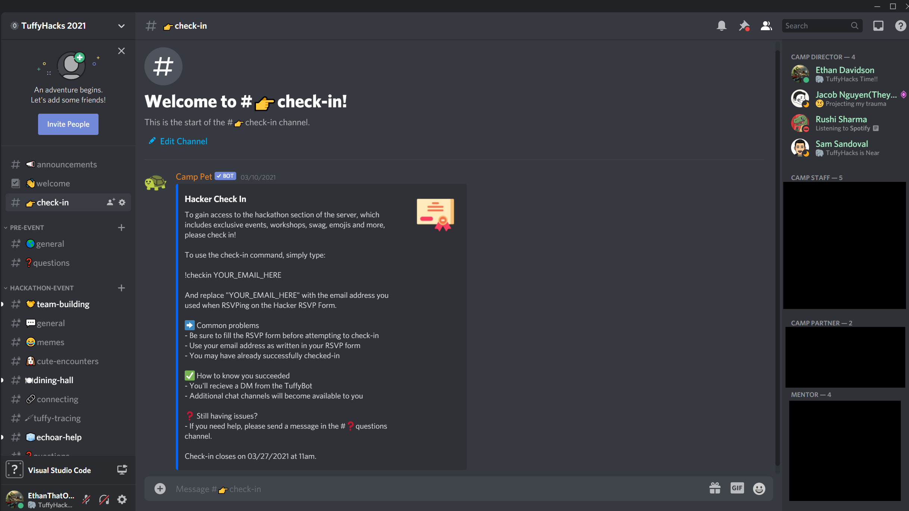

# My TuffyHacks 2021 Experience 🐘

> This is the detailed account of my experience as the Head of Technology of TuffyHacks.

## Contents

- [**What is TuffyHacks?**](#what-is-tuffyhacks): Explanation behind the TuffyHacks event.
- [**Service**](#service): How I contributed during the event.
- [**Software**](#software): Details on the software that I created for this event.
- [**Preparation**](#preparation): How TuffyHacks was prepared and how I helped.
- [**Press**](#press): Published articles pertaining to TuffyHacks 2021.

## TL;DR

I served as the Head of Technology for CSUF's first ever hackathon, TuffyHacks.

## What is TuffyHacks?

TuffyHacks is a weekend-long event where students come together to learn the latest technologies and build innovative projects.
Our goal was to allow as many students as possible to experience a hackathon in a beginner-friendly setting where they can meet a ton of like-minded friends in the tech.
This event was huge for our computer science/engineering community at California State University Fullerton (CSUF) in that it was the first ever hackathon-like event that was built by CSUF students, for CSUF students.

In the year 2021, TuffyHacks was 100% virtual due to health/safety restrictions, so the event was primarily experienced via [**@discord**](https://github.com/discord/) and [**@twitch**](https://github.com/twitchtv/).
Since the event was held virtually, we also invited people from across the world to register as well.

## Service

During the TuffyHacks event, I helped out with several components of the event.

- Monitored the server running the [`tuffyhacks-bot`](#tuffyhacks-bot).
- Made live updates to [`tuffyhacks.com`](#tuffyhacks.com) as the event progressed.
- Responded to participants' questions in the specified "questions" text channel.
- Assisted participants with checking in.
- Controlled the presentation during the opening and closing ceremonies.

## Software

As Head of Technology, I authored software that was critical to the success of this event.

### `tuffyhacks.com`

> Demo: <https://tuffyhacks.com/>, Code: <https://github.com/EthanThatOneKid/tuffyhacks.com/>

This is the source code of TuffyHacks' official website, [`tuffyhacks.com`](https://tuffyhacks.com); built on [Next.js](https://github.com/vercel/next.js).

Using the marketing team's designs, I created the landing page where participants could apply or learn more information about TuffyHacks.
This page included the following sections:

- Splash screen where participants could click to register for the event.
- An "about" section where participants could read some basic information about the event.
- A section that displays the official sponsors/partners. Before the sponsors were finalized, prospecting sponsors used this section apply to sponsor or get into contact with the TuffyHacks team.
- An obligatory FAQ section at the bottom.

Additionally, I created a "Meet the Team" page ([`tuffyhacks.com/meet-the-team`](https://tuffyhacks.com/meet-the-team/)) where the members of the TuffyHacks team are displayed together.
I also designed/created another splash screen ([`tuffyhacks.com/event`](https://tuffyhacks.com/event/)) specifically for the event's live stream.

Here is what the `/event` page looked like as the event was approaching for the months leading up to the event:

Here is what the live stream looked like before the event started:

...And here is what the same page looked like during the event:

### `tuffyhacks-bot`

> Code: <https://github.com/EthanThatOneKid/tuffyhacks-bot/>

The official TuffyHacks bot was created by myself and managed the check-in process for the participants.
During the event, this Discord bot ran on a Digital Ocean droplet and went smoothly.

Here is what the check-in channel looked like on Discord:

This bot is written in JavaScript and ran using [Node.js](https://nodejs.org/).
As for major libraries, I used [Discord.js](https://github.com/discordjs/discord.js/) for interacting with Discord messages, [Express](https://github.com/expressjs/express) for an admin-only API for monitoring participant check-ins, and [NeDB](https://github.com/louischatriot/nedb) for persistent storage in case the server crashes.

## Preparation

We spent about 4 months preparing and planning TuffyHacks in order to make this event as great as we possibly could.

- The [TuffyHacks Team](https://tuffyhacks.com/meet-the-team/) would meet for at least 1 hour per week for the 4 months leading up to the event.
- I worked on [`tuffyhacks.com`](#tuffyhacks.com) and the [`tuffyhacks-bot`](#tuffyhacks-bot) in my free time.
- Recorded a video ad for one of the sponsors, [**@digitalocean**](https://github.com/digitalocean).

## Press

### Daily Titan

Within the week approaching the event, a reporter from the Daily Titan interviewed me and 2 other event directors about TuffyHacks, CSUF's first ever hackathon.

News Article: <https://dailytitan.com/eedition/page-7/page_2037179b-4853-5606-9739-c0e35f5109fa.html>

Accompanying Social Media Post: <https://www.instagram.com/p/CM5JU0dpqXg/>

### DevPost

During the event, participants submitted their projects via an online platform called [_DevPost_](https://devpost.com/).
Once the project deadline was reached, event organizers and judges selected the winning projects in multiple categories.
The winners are listed under the [project gallery](https://tuffyhacks-2021.devpost.com/project-gallery).

TuffyHacks Event on DevPost: <https://tuffyhacks-2021.devpost.com/>

---

An [EthanThatOneKid](https://github.com/EthanThatOneKid/) experience ✨